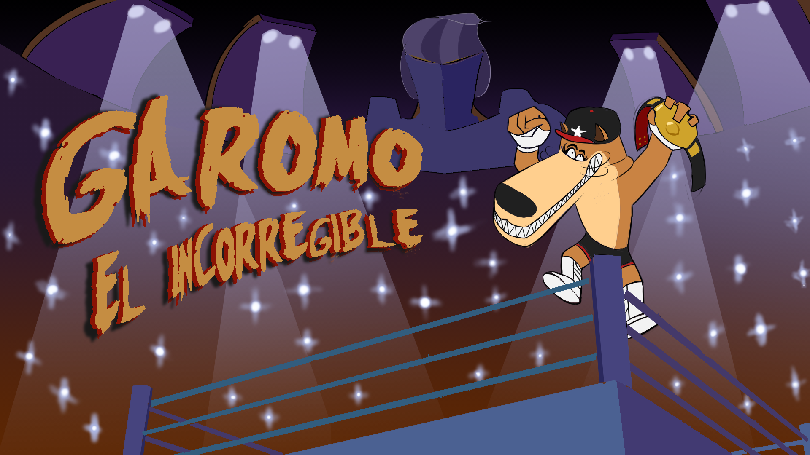

# Garomo "El Incorregible"

Garomo "El Incorregible" is the odyssey of a shiba inu in a japanese city, where there's lots of respect for "lucha libre" and american cartoons. 

Garomo suffers an accident and after a crazy american scientist tries to save his life through a dangerous experiment, he mutates into a bipedal crocodile-dog hybrid capable of fighting. 

Now Garomo must rescue his owner from the claws of the scientist that caused his mutation, in this bizarre adventure full of action.

This is a game (demo/protoype/vertical slice) developed by students from <a href="https://www.imagecampus.edu.ar/">Image Campus</a>

   

## Credits

- **Patricio Di Lauro** - *Programming* - 
- **Gonzalo Barrionuevo** - *Art* -     
- **Francisco Gallino** - *Art* -     
- **Sebastian Roa** - *Art* -     
- **Jose Ernesto Gomez** - *Audio* -     
- **Geronimo Rath** - *Audio* -     
- **Emiliano Calbucura** - *Testing* -     
- **Ivan Fernandez** - *Testing* -     

This game was also possible thanks to the support of these professors:

- **Sergio Baretto**
- **Federico Barra**
- **Jorge Cuéllar**
- **Fernando Puig**
- **Eugenio Taboada**

## Acknowledgements

- Gregorio Gomez, whose voice was used in enemies sounds.
- Everyone who playtested our game at "Nucleo".

## Links

Download it from itch.io: https://bulgeoffire.itch.io/garomo
